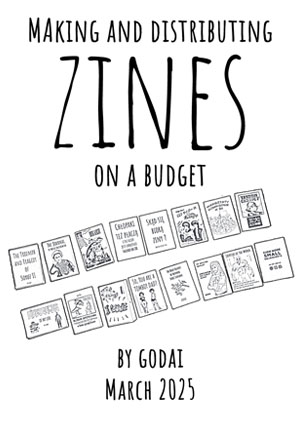

# Creating and distributing zines on a budget <!-- omit in toc -->

[Wersja PL](tworzenie_zinow.md)

- [What are zines?](#what-are-zines)
- [Making zines](#making-zines)
	- [Plan Your Zine](#plan-your-zine)
	- [Design and Layout](#design-and-layout)
	- [Printing on a Budget](#printing-on-a-budget)
	- [Binding \& Assembly](#binding--assembly)
	- [Free \& Low-Cost Distribution](#free--low-cost-distribution)
	- [Keep Costs Low](#keep-costs-low)
- [Free minizine to download](#free-minizine-to-download)

## What are zines?

Zines (short for "magazines" or "fanzines") are small, self-published booklets that cover a wide range of topics, from art and activism to personal stories and niche interests. Often created with a DIY approach, zines can be handmade, photocopied, or digitally printed, making them an accessible and low-cost way to share ideas. They have roots in underground and countercultural movements, allowing creators to express themselves freely without the constraints of mainstream publishing. Whether political, poetic, or purely artistic, zines serve as a powerful tool for self-expression and community building.

## Making zines

Creating and distributing zines on a budget is totally doable with some creativity and resourcefulness. Here’s a step-by-step guide to help you:

### Plan Your Zine

* Decide on a theme or focus for your zine (e.g., art, poetry, activism, personal essays).
* Determine the format: A5, A6, or even a simple single-sheet foldable zine to save on printing.
* Keep it short to minimize printing costs.

### Design and Layout

* Use free software like Canva, Krita, Scribus, or even Google Docs for layout.
* Hand-drawn & collaged zines work well if you prefer an analog and oldschool style—just scan or photocopy.
* Keep it black and white if printing to cut volume and hence costs.

### Printing on a Budget

* Photocopying: Local libraries, schools, or office supply stores offer cheap copies.
* DIY Printing: Use your home printer and draft mode to save ink.
* Risograph Printing: If you have access to a Riso machine, it’s a cheap option for bulk printing.
* Recycled Paper: Check thrift stores, scrap bins, or ask print shops for leftover paper.

### Binding & Assembly

* Staple-bound (use a long-arm stapler for neatness).
* Fold & cut (single-sheet mini zines are easy and cost nothing for binding).
* Thread binding if you want a more handmade feel.

### Free & Low-Cost Distribution

* Local Spots: Leave copies at cafes, bookstores, libraries, community centers, or record shops.
* Mail Trades: Trade zines with other zinesters via mail.
* Zine Fests & DIY Events: Sell or give them away at zine fairs.
* Online PDFs: Offer free or pay-what-you-can PDFs via Gumroad, Itch.io, or a blog.
* Social Media: Promote on Instagram, Tumblr, or Twitter. Use hashtags like #zines #DIYzines.
* Etsy or Big Cartel: Sell physical copies affordably.
* Ko-fi or Patreon: Offer zines as rewards for small donations.
* Zine Libraries & Distros: Submit to indie distros.

### Keep Costs Low

* Collaborate with others to share printing and shipping costs.
* Use found materials (scrap paper, old magazines).
* Print only as many as needed to avoid waste.

---

## Free minizine to download

[Download a print-ready minizine (soon!)](#)
